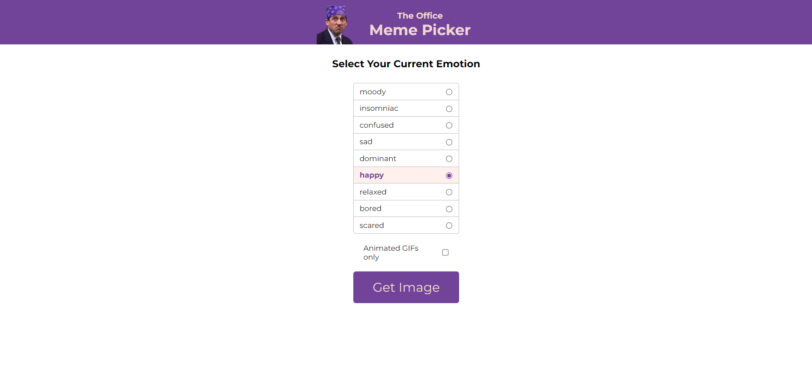
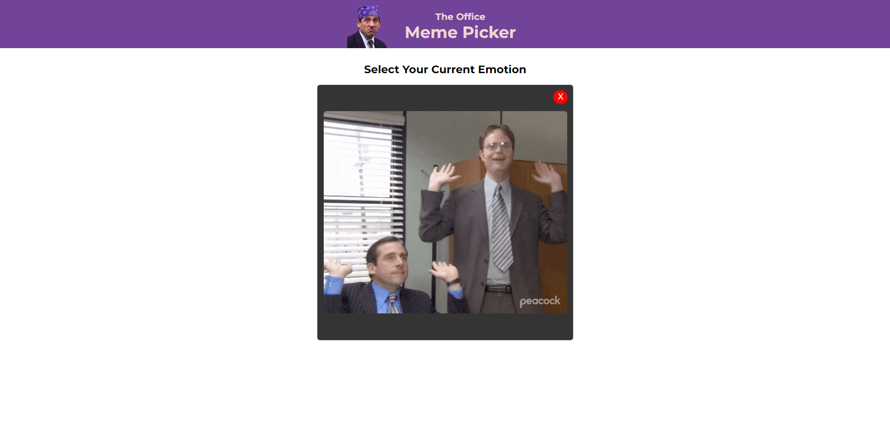

# The Office Meme Picker

The Office Meme Picker is an application that shows a random gif or photo from [The Office](https://en.wikipedia.org/wiki/The_Office_(American_TV_series)) series based on the mood you select at that moment.

## Screenshots

## Usage

**EMOTION RADIOS** : You can select any mood from this section.

**ANIMATED GIF'S ONLY** : If you click on this option, it will only display GIFs.

**GET IMAGE** : When you click this button, a pop-up opens that shows a random gif or photo based on the mood you selected.

## Technologies Used

This project was built using the following technologies:

- HTML
- CSS
- JavaScript

## Acknowledgements

I learned how to make a Chrome Extension in JavaScript from [Scrimba](https://v2.scrimba.com/home) and received help from there.

## Special Thanks

This project turned out much bigger than I expected! - **that's what she said!**

**I would like to express my gratitude to everyone involved in the making of The Office.**